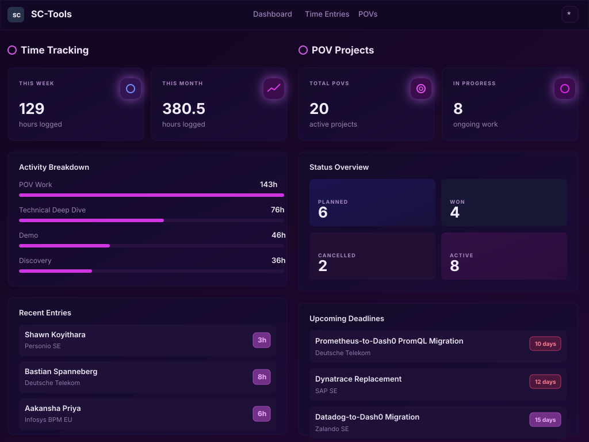
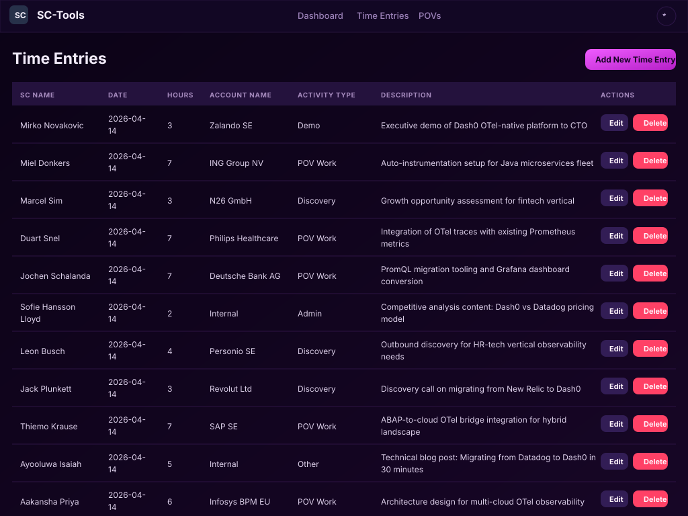
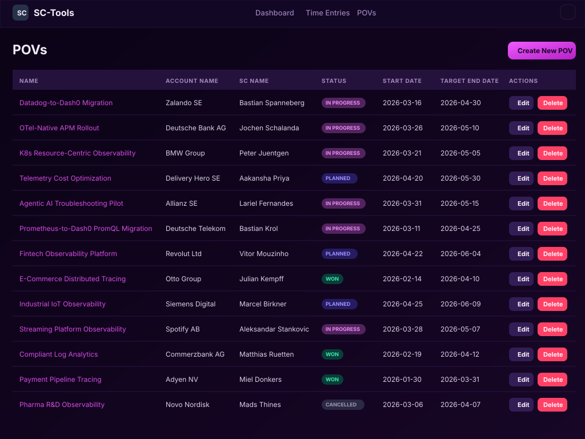

# SC-Tools

SC-Tools is a lightweight web application for Solution Consultants to track time and manage POVs. It runs as a Java 21 application with embedded Jetty, JSP pages, and an embedded H2 database.

## What it does

- Tracks Solution Consultant time entries by date, hours, account, activity type, and notes.
- Manages POVs, including status, dates, descriptions, and success criteria.
- Provides a dashboard with time-entry totals and POV status summaries.
- Stores local data in an H2 database under `./data`.

## Requirements

Install these before running the tool:

- Java 21
- Maven 3.8 or newer

Check your local versions:

```bash
java -version
mvn -version
```

## Fire up the tool

From the repository root, run:

```bash
mvn clean package
java -jar target/sc-tools-1.0-SNAPSHOT.jar
```

Then open the app in your browser:

```text
http://localhost:8090
```

The root URL redirects to the dashboard. You can also open:

- `http://localhost:8090/dashboard`
- `http://localhost:8090/time-entries`
- `http://localhost:8090/povs`

Stop the server with `Ctrl+C` in the terminal where it is running.

## Local database

SC-Tools creates its local H2 database automatically on startup:

```text
data/sctools.mv.db
```

No manual database setup is required.

To reset local data, stop the app and remove the generated database files:

```bash
rm -f data/sctools.*
```

The next startup will recreate the schema.

## Run tests

Run the full test suite with:

```bash
mvn test
```

## Build a runnable JAR

Package the application with:

```bash
mvn clean package
```

The runnable JAR is created at:

```text
target/sc-tools-1.0-SNAPSHOT.jar
```

## Optional: run with OpenTelemetry

If you want backend telemetry, download the OpenTelemetry Java agent into `lib`:

```bash
curl -L \
  -o lib/opentelemetry-javaagent.jar \
  https://github.com/open-telemetry/opentelemetry-java-instrumentation/releases/latest/download/opentelemetry-javaagent.jar
```

Start the app with the agent attached:

```bash
OTEL_SERVICE_NAME=sc-tools \
OTEL_EXPORTER_OTLP_ENDPOINT=http://localhost:4317 \
OTEL_EXPORTER_OTLP_PROTOCOL=grpc \
java -javaagent:lib/opentelemetry-javaagent.jar \
  -jar target/sc-tools-1.0-SNAPSHOT.jar
```

The app also includes a Dash0 browser SDK snippet in `src/main/webapp/WEB-INF/jsp/layout/header.jsp`. Replace the placeholder token there before using browser telemetry in a real environment.

## Project layout

```text
src/main/java/com/dash0/sctools/
  Application.java          Embedded Jetty entry point
  dao/                      JDBC data access
  model/                    Domain models
  servlet/                  HTTP request handlers
  util/                     Database initialization

src/main/webapp/
  WEB-INF/jsp/              JSP views
  static/                   CSS and static assets
```

## Screenshots

### Dashboard



### Time Entries



### POVs


